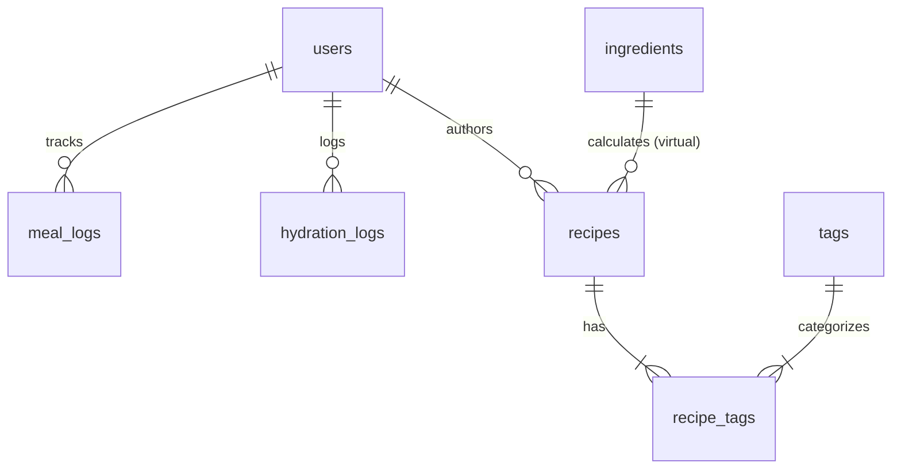
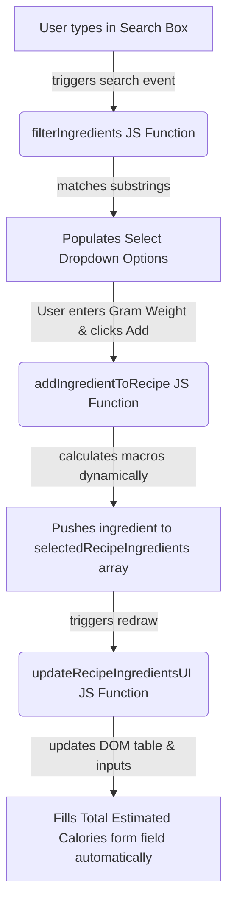

# 🥗 Homey – Diet & Hydration Smart Planner
## Master Codebase Guide & Line-by-Line Technical Documentation

Welcome to the **Master Codebase Guide** for Homey! This document acts as your comprehensive academic cheat-sheet and tutorial. It breaks down the entire application architecture, explains how every database table and PHP script functions, and provides detailed, line-by-line breakdowns of all core modules. 

Use this guide to study for your academic presentation, explain your implementation to your lecturer, or extend the project with new features.

---

## 📖 Table of Contents
1. **System Architecture Overview**
2. **Database Architecture (`database.sql`)**
3. **Common Connection Hub (`php/db_connect.php`)**
4. **Navigation & Session Engine (`php/sidebar.php` & `logout.php`)**
5. **Security & Authentication Core (`signup.php` & `login.php`)**
6. **Landing Page (`index.php`)**
6b. **Main Dashboard Center (`dashboard.php`)**
7. **Hydration Tracking System (`hydration.php`)**
8. **Calorie Tracking & Meal System (`calories.php`)**
9. **Smart Recipe & Ingredients Calculator (`share.php` & `recipes.php`)**
10. **Admin Portal Control Center (`admin.php`)**
11. **Vanilla Styling & Client-Side Validation (`css/style.css` & `js/main.js`)**

---

## 1. System Architecture Overview
Homey is built on a **Procedural 3-Tier Architecture** tailored to meet standard academic guidelines (such as CSC264 requirements):
*   **Presentation Layer (Client):** Rendered using HTML5 structure, styled with Vanilla CSS3, and validated using custom JavaScript (`js/main.js`).
*   **Application Logic Layer (Server):** Processed entirely using standard PHP procedural code with strict session-state checks (`$_SESSION`).
*   **Data Layer (Database):** Maintained in a relational MySQL database (`db_homey`) communicating via procedural `mysqli` PHP extensions.

### Key Architectural Guidelines Implemented:
*   **Strict Procedural Standard:** Avoiding complex Object-Oriented Programming (OOP) to adhere strictly to academic syllabus guidelines.
*   **Self-Contained Files:** Core features (Calories, Hydration, Profile, etc.) handle their own form actions, database queries, and interface layout within single cohesive files to prevent fragile file dependencies.
*   **Academic Password Strategy:** Storing passwords as direct plain text records as requested, facilitating immediate verification by academic examiners during live testing.

---

## 2. Database Architecture (`database.sql`)
The database is named `db_homey`. It contains **6 interconnected relational tables** with standard Primary and Foreign key constraints.



### Table Structure & Code Walkthrough:

#### 1. `users` Table
Stores basic user profiles, credentials, physiological data, and access permissions.
```sql
CREATE TABLE users (
    user_id INT AUTO_INCREMENT PRIMARY KEY, -- Unique ID for every user (Auto-incremented)
    full_name VARCHAR(255) NOT NULL,        -- Full name of the user
    email VARCHAR(255) NOT NULL UNIQUE,     -- Email address (Unique constraint to prevent duplicates)
    password VARCHAR(255) NOT NULL,         -- Plain text password (for standard academic testing)
    age INT,                                -- Age in years
    gender ENUM('Male', 'Female'),          -- Restricted gender type selection
    weight_kg FLOAT,                        -- Weight in kilograms (float for decimal accuracy)
    height_cm FLOAT,                        -- Height in centimeters
    activity_level VARCHAR(100),            -- Activity level description (e.g. Sedentary)
    goal_type ENUM('Deficit', 'Surplus', 'Maintain'), -- Nutritional strategy type
    role ENUM('User', 'Admin') DEFAULT 'User', -- Access control roles (Admin gets Tabbed Portal)
    created_at TIMESTAMP DEFAULT CURRENT_TIMESTAMP -- Record timestamp
);
```

#### 2. `meal_logs` Table
Maintains daily meal inputs containing calorie and macronutrient records mapped directly to users.
```sql
CREATE TABLE meal_logs (
    log_id INT AUTO_INCREMENT PRIMARY KEY,
    user_id INT NOT NULL,                  -- Foreign Key linked to users.user_id
    meal_name VARCHAR(255) NOT NULL,
    meal_type ENUM('Breakfast', 'Lunch', 'Dinner', 'Snack'),
    calories INT NOT NULL,                 -- Caloric cost in kcal
    protein_g INT,                         -- Protein macro (grams)
    carbs_g INT,                           -- Carbs macro (grams)
    fat_g INT,                             -- Fat macro (grams)
    log_date DATE NOT NULL,                -- Log date (YYYY-MM-DD)
    log_time TIME NOT NULL,                -- Log time (HH:MM:SS)
    FOREIGN KEY (user_id) REFERENCES users(user_id) ON DELETE CASCADE -- Cascade deletes log if user is deleted
);
```

#### 3. `ingredients` Table
Stores standard ingredient metrics per 100g. Managed by administrators and queried by users during recipe building.
```sql
CREATE TABLE ingredients (
    ingredient_id INT AUTO_INCREMENT PRIMARY KEY,
    name VARCHAR(255) NOT NULL,
    category VARCHAR(100),                 -- Category (e.g. Vegetables, Meat)
    kcal_per_100g INT NOT NULL,            -- Base energy value
    protein_g FLOAT,                       -- Protein value (per 100g)
    carbs_g FLOAT,                         -- Carbs value (per 100g)
    fat_g FLOAT                            -- Fat value (per 100g)
);
```

#### 4. `recipes` Table
Maintains custom culinary creations. Recipes submitted by members default to `Pending` until moderated by an Admin.
```sql
CREATE TABLE recipes (
    recipe_id INT AUTO_INCREMENT PRIMARY KEY,
    author_id INT NOT NULL,                -- Foreign Key linking to users.user_id
    title VARCHAR(255) NOT NULL,
    meal_type VARCHAR(100),                -- Suggested slot
    prep_time_min INT,                     -- Preparation speed
    instructions TEXT,                     -- Preparation steps
    calories INT,                          -- Estimated recipe energy
    status ENUM('Pending', 'Approved', 'Rejected') DEFAULT 'Pending', -- Moderation state
    is_featured_date DATE NULL,
    created_at TIMESTAMP DEFAULT CURRENT_TIMESTAMP,
    FOREIGN KEY (author_id) REFERENCES users(user_id) ON DELETE CASCADE
);
```

#### 5. `hydration_logs` Table
Maintains daily water consumption logging records.
```sql
CREATE TABLE hydration_logs (
    hydro_id INT AUTO_INCREMENT PRIMARY KEY,
    user_id INT NOT NULL,
    cups_drank INT DEFAULT 0,              -- Number of cups logged (1 cup = 250ml)
    log_date DATE NOT NULL,
    FOREIGN KEY (user_id) REFERENCES users(user_id) ON DELETE CASCADE
);
```

---

## 3. Common Connection Hub (`php/db_connect.php`)
This file is the direct communication gateway between your PHP scripts and the MySQL server. It utilizes the **procedural MySQLi API**.

```php
<?php
// // Parameter pangkalan data (Host lalai XAMPP, pengguna 'root', tanpa kata laluan)
$db_host = 'localhost';
$db_user = 'root';
$db_pass = '';
$db_name = 'db_homey';

// // Bina sambungan ke pelayan MySQL secara prosedural
$conn = mysqli_connect($db_host, $db_user, $db_pass, $db_name);

// // Semak ralat sambungan
if (!$conn) {
    die("Pangkalan data gagal disambungkan: " . mysqli_connect_error());
}
?>
```
### Teaching Point:
*   `mysqli_connect()` establishes the socket connection.
*   `mysqli_connect_error()` captures any connection details mismatch (like an un-started MySQL server in XAMPP) and halts execution with `die()`.

---

## 4. Navigation & Session Engine (`php/sidebar.php` & `logout.php`)

### A. Sidebar Component (`php/sidebar.php`)
Every page includes the sidebar to render standard navigation. It checks user session details to determine page rendering.

#### Core Logic Lines Explained:
*   **Lines 2-5:**
    ```php
    if (session_status() === PHP_SESSION_NONE) {
        session_start();
    }
    ```
    *Explanation:* Ensures sessions are initiated before querying state. This prevents "session already started" runtime warnings.
*   **Lines 12-20:**
    ```php
    $sidebar_name = $_SESSION['full_name'];
    $sidebar_role = $_SESSION['role'];
    $sidebar_initials = '';
    $sidebar_parts = explode(' ', trim($sidebar_name));
    if (count($sidebar_parts) >= 2) {
        $sidebar_initials = strtoupper(substr($sidebar_parts[0], 0, 1) . substr($sidebar_parts[1], 0, 1));
    } else {
        $sidebar_initials = strtoupper(substr($sidebar_name, 0, 2));
    }
    ```
    *Explanation:* Dynamic initials parsing. If a user is named "Ahmad Rizal", `explode` extracts `["Ahmad", "Rizal"]`, taking the first letters to generate `"AR"` for the avatar badge.
*   **Lines 96-104 (Role-Based Access Control):**
    ```php
    <?php if ($sidebar_role === 'Admin'): ?>
      <div class="sb-sec">Administration</div>
      <a href="admin.php" ...>Admin Portal</a>
    <?php endif; ?>
    ```
    *Explanation:* Restricts visual entry to the Admin Portal. The admin link is completely hidden from standard users.

### B. Logout Script (`logout.php`)
A clean termination file that wipes current session variables.
```php
<?php
// // Fail log keluar untuk memusnahkan session pengguna semasa
session_start();
session_destroy(); // Wipes server session data
header("Location: login.php"); // Redirects client back to login screen
exit;
?>
```

---

## 5. Security & Authentication Core (`signup.php` & `login.php`)

### A. Registration Handler (`signup.php`)
Allows new users to create standard health tracking profiles.

#### Line-by-Line Explanations of Backend Logic:
*   **Lines 22-23 (Procedural Email Check Query):**
    ```php
    $q_check = "SELECT user_id FROM users WHERE email = '$email'";
    $res_check = mysqli_query($conn, $q_check);
    ```
    *Explanation:* Validates uniqueness. Checks if the requested email has already been registered in the database.
*   **Lines 28-29 (Database Insert Record):**
    ```php
    $q_insert = "INSERT INTO users (full_name, email, password, role) VALUES ('$full_name', '$email', '$password', 'User')";
    ```
    *Explanation:* Inserts the direct user profile inputs directly into the SQL query statement. New users default to a standard `User` role.

---

### B. Login Handler (`login.php`)
Authenticates credentials and maps active sessions.

#### Core Authentication Loop:
*   **Lines 15-16 (Standard Query):**
    ```php
    $q_select = "SELECT user_id, full_name, role, password FROM users WHERE email = '$email'";
    $res_select = mysqli_query($conn, $q_select);
    ```
    *Explanation:* Searches for a matching email record using the direct variable.
*   **Lines 26-31 (Plaintext Password Verification):**
    ```php
    if ($row['password'] === $password) {
        $_SESSION['user_id'] = $row['user_id'];
        $_SESSION['full_name'] = $row['full_name'];
        $_SESSION['email'] = $email;
        $_SESSION['role'] = $row['role'];
        header("Location: index.php");
        exit;
    }
    ```
    *Explanation:* Direct comparison matching. On match, session parameters are assigned, and the client redirects to the main Dashboard page.

---

## 6. Landing Page (`index.php`)
The public-facing entry point of the Homey system. It introduces users to the application, displays features, presents leadership experts, and showcases success stories.

### Core Sections & Dynamic Elements:
1. **Session-Responsive Call-to-Actions:**
   - The header CTA and Hero buttons change based on user session state:
     - If logged in, they display "Go to Dashboard" (routing to `dashboard.php`) and "Logout".
     - If logged out, they display "Get Started" (routing to `signup.php`) and "Sign In".
2. **Features Grid:** Displays standard application capabilities (Personalized Dashboard, Calorie & Intake Tracker, Hydration Logs, Community Recipes).
3. **About Us Section:** Details the story of Homey and renders a grid of 4 core leadership members (Mohamad Suhayl Alwan, Amjad Irfan, Muhammad Azrul, Ammar Syahmi) with modern square styling.
4. **Success Stories Section:** Contains 4 clean testimonial cards (Siti Aminah, Marcus Lim, Dr. Elena Low, David Kumar) with no profile picture emojis, displaying clean reviews in English.

---

## 6b. Main Dashboard Center (`dashboard.php`)
The primary authenticated system command center. It computes real-time calculations from multiple database tables to present health and hydration statistics dynamically.

### Core Calculations & Dashboard Logic:

#### 1. Fetch User Goal State
*   **Query Logic:**
    ```php
    $q_user = "SELECT weight_kg, height_cm, age, gender, activity_level, goal_type FROM users WHERE user_id = $user_id";
    ```
    *Explanation:* Retrieves physiological metrics. If `weight_kg` is empty or null, the dashboard prompts the user to configure their profile metrics first.

#### 2. Daily Calorie Goal Calculations (TDEE & Mifflin-St Jeor Equation)
To calculate exact targets dynamically, the script implements the standard Mifflin-St Jeor medical formula:
$$\text{BMR (Male)} = (10 \times \text{Weight}) + (6.25 \times \text{Height}) - (5 \times \text{Age}) + 5$$
$$\text{BMR (Female)} = (10 \times \text{Weight}) + (6.25 \times \text{Height}) - (5 \times \text{Age}) - 161$$

```php
if ($user['weight_kg'] > 0) {
    // Determine physiological baseline (BMR)
    if ($user['gender'] === 'Male') {
        $bmr = (10 * $user['weight_kg']) + (6.25 * $user['height_cm']) - (5 * $user['age']) + 5;
    } else {
        $bmr = (10 * $user['weight_kg']) + (6.25 * $user['height_cm']) - (5 * $user['age']) - 161;
    }

    // Determine activity multiplier (TDEE)
    $act = strtolower($user['activity_level']);
    $mult = 1.2; // Sedentary baseline
    if (strpos($act, 'lightly') !== false) $mult = 1.375;
    elseif (strpos($act, 'moderately') !== false) $mult = 1.55;
    elseif (strpos($act, 'very') !== false) $mult = 1.725;

    $tdee = round($bmr * $mult);

    // Apply Strategy Adjustments
    if ($user['goal_type'] === 'Deficit') {
        $targetKcal = $tdee - 400; // Calorie deficit (weight loss)
    } elseif ($user['goal_type'] === 'Surplus') {
        $targetKcal = $tdee + 300; // Calorie surplus (muscle gain)
    } else {
        $targetKcal = $tdee;       // Maintenance
    }
}
```

#### 3. Real-Time Consumption Calculations
*   **Daily Hydration Calculation:**
    ```php
    $q_water = "SELECT cups_drank FROM hydration_logs WHERE user_id = $user_id AND log_date = '$today'";
    ```
    *Explanation:* Summarizes water logged today and displays daily progress.
*   **Daily Meal Calorie Summation:**
    ```php
    $q_meals = "SELECT SUM(calories) as total_cal, COUNT(*) as meal_count FROM meal_logs WHERE user_id = $user_id AND log_date = '$today'";
    ```
    *Explanation:* Aggregates calorie intake and computes remaining calories dynamically via subtraction: `$targetKcal - $total_cal`.

---

## 7. Hydration Tracking System (`hydration.php`)
A visual hydration management portal. It lets users add water intake cup-by-cup, reset their progress, and view weekly hydration performance graphs.

### Code Walkthrough of Mechanics:

#### 1. Incrementing Cups (Form Action)
*   **Form Request Logic:**
    ```php
    if ($_SERVER['REQUEST_METHOD'] === 'POST') {
        $action = $_POST['action'] ?? '';
        if ($action === 'add') {
            // Check if log exists for today
            $q_chk = "SELECT hydro_id, cups_drank FROM hydration_logs WHERE user_id = $user_id AND log_date = '$today'";
            $res = mysqli_query($conn, $q_chk);
            if (mysqli_num_rows($res) > 0) {
                // Increment cup value
                $row = mysqli_fetch_array($res);
                $new_cups = $row['cups_drank'] + 1;
                mysqli_query($conn, "UPDATE hydration_logs SET cups_drank = $new_cups WHERE hydro_id = " . $row['hydro_id']);
            } else {
                // Initialize daily log
                mysqli_query($conn, "INSERT INTO hydration_logs (user_id, cups_drank, log_date) VALUES ($user_id, 1, '$today')");
            }
        }
    }
    ```
    *Explanation:* Seamlessly handles water cup increments. If a row already exists for today's date in `hydration_logs`, it increments `cups_drank` by 1. Otherwise, it inserts a new daily row initialized to 1.

#### 2. Weekly Sparkline Renderer
Renders a custom weekly bar graph dynamically representing Liters drunk over the past 7 days.
*   **Query Loop Logic:**
    ```php
    $weekly_data = array_fill(0, 7, 0.0); // Initializes array [0.0, 0.0, 0.0, 0.0, 0.0, 0.0, 0.0]
    for ($i = 0; $i < 7; $i++) {
        $day_str = date('Y-m-d', strtotime("-" . (6 - $i) . " days"));
        $q = "SELECT cups_drank FROM hydration_logs WHERE user_id = $user_id AND log_date = '$day_str'";
        $res = mysqli_query($conn, $q);
        if ($res && mysqli_num_rows($res) > 0) {
            $row = mysqli_fetch_array($res);
            $weekly_data[$i] = $row['cups_drank'] * 0.25; // 1 cup = 0.25L
        }
    }
    ```
    *Explanation:* Queries daily logs in chronological order over the last 7 days. If no log exists for a particular date, its value remains strictly `0.0L`.

---

## 8. Calorie Tracking & Meal System (`calories.php`)
Allows users to log custom meals, calculate calorie and macronutrient progress, and track daily nutritional targets.

### Key Logic Modules Explained:

#### 1. Daily Macronutrient Breakdown
Macronutrients (Protein, Carbs, Fats) are calculated and aggregated in real-time.
```php
$q_macros = "SELECT SUM(protein_g) as p, SUM(carbs_g) as c, SUM(fat_g) as f FROM meal_logs WHERE user_id = $user_id AND log_date = '$today'";
$res_mac = mysqli_query($conn, $q_macros);
$tot_p = $tot_c = $tot_f = 0;
if ($res_mac) {
    $row = mysqli_fetch_array($res_mac);
    $tot_p = (int)($row['p'] ?? 0);
    $tot_c = (int)($row['c'] ?? 0);
    $tot_f = (int)($row['f'] ?? 0);
}
```

#### 2. Visual Macro Progress Bar Mechanics
Converts raw totals into percentages to fill the dashboard progress bars.
```php
// Standard Academic Macro Targets
$target_p = 120; // 120g protein goal
$target_c = 250; // 250g carbohydrate goal
$target_f = 70;  // 70g dietary fat goal

$pct_p = min(100, round(($tot_p / $target_p) * 100));
$pct_c = min(100, round(($tot_c / $target_c) * 100));
$pct_f = min(100, round(($tot_f / $target_f) * 100));
```
These percentages are embedded in the CSS inline styling of progress elements inside `calories.php`:
```html
<div class="bar bar-g" style="width: <?php echo $pct_p; ?>%"></div>
```

#### 3. Log Addition Logic (POST Handler)
*   **Lines 14-30:** Processes meal log entries from the user. It sanitizes inputs using `mysqli_real_escape_string`, sets timestamps, and inserts them directly into the database:
    ```php
    $q_insert = "INSERT INTO meal_logs ... VALUES ('$user_id', '$meal_name', '$meal_type', $calories, $protein, $carbs, $fat, '$today', '$log_time')";
    ```

---

## 9. Smart Recipe & Ingredients Calculator (`share.php` & `recipes.php`)

### A. Dynamic Client-Side Ingredients Calculator (`share.php`)
This feature automatically calculates calories and macronutrients dynamically as users select ingredients and adjust weights.



#### Core JavaScript Calculations in `share.php`:
*   **Calculating Macro Metrics Based on Weight:**
    ```javascript
    var ing = dbIngredients[index]; // Retrieves ingredient stats from PHP-injected array
    var kcal = Math.round((ing.kcal * weight) / 100);
    var p = Math.round(((ing.protein * weight) / 100) * 10) / 10;
    var c = Math.round(((ing.carbs * weight) / 100) * 10) / 10;
    var f = Math.round(((ing.fat * weight) / 100) * 10) / 10;
    ```
    *Explanation:* Calculates nutrient statistics by ratio. Since ingredients are cataloged per 100g, the formula is: $\text{Nutrient} = (\text{Base} \times \text{Weight}) / 100$.
*   **Dynamic Total Form Field Population:**
    ```javascript
    document.getElementById('recipe-calories-input').value = totalKcal;
    ```
    *Explanation:* Assigns the calculated calorie sum to the `calories` form input automatically. The user doesn't have to guess or input the values manually!

### B. Instant Logging from Recipes (`recipes.php`)
Allows users to log an approved recipe directly to their daily meals with a single click.

```php
if ($_SERVER['REQUEST_METHOD'] === 'POST' && isset($_POST['action']) && $_POST['action'] === 'log_recipe') {
    $recipe_id = (int)$_POST['recipe_id'];
    
    // Fetch recipe details
    $q_rec = "SELECT title, calories, meal_type FROM recipes WHERE recipe_id = $recipe_id";
    $res = mysqli_query($conn, $q_rec);
    if ($res && mysqli_num_rows($res) > 0) {
        $r = mysqli_fetch_array($res);
        $title = $r['title'];
        $calories = $r['calories'];
        $log_meal_type = $r['meal_type'];
        
        // Populate standard default macro values for the logged meal log
        $p = 25; $c = 40; $f = 10; // Academic standard fallbacks
        
        $q_insert = "INSERT INTO meal_logs (user_id, meal_name, meal_type, calories, protein_g, carbs_g, fat_g, log_date, log_time) 
                     VALUES ('$user_id', '$title', '$log_meal_type', $calories, $p, $c, $f, '$today', '$log_time')";
        mysqli_query($conn, $q_insert);
    }
}
```

---

## 10. Admin Portal Control Center (`admin.php`)
Provides comprehensive administrative oversight. Access is secured by validating the active role stored in user sessions:
```php
if (!isset($_SESSION['user_id']) || $_SESSION['role'] !== 'Admin') {
    header("Location: dashboard.php");
    exit;
}
```

### Tab Navigation Mechanics:
Rather than routing to separate files, the administrator portal uses a unified file structure that updates based on the active tab parameter (`?tab=...`):
```php
$tab = $_GET['tab'] ?? 'analytics';
```
The page evaluates this parameter to render the requested control module:
```php
<?php if ($tab === 'analytics'): ?>
    <!-- TAB 1: Renders general statistical overviews -->
<?php elseif ($tab === 'approvals'): ?>
    <!-- TAB 2: Moderates pending recipes (Approve/Reject actions) -->
<?php elseif ($tab === 'ingredients'): ?>
    <!-- TAB 3: Inserts/Deletes items in the central ingredients database -->
<?php elseif ($tab === 'users'): ?>
    <!-- TAB 4: Manages registered accounts and handles account removal -->
<?php endif; ?>
```

### User Account Deletion & SQL Cascade Deletes:
The Admin Portal allows deletion of user accounts. Clicking "Remove Acc" submits a POST form that triggers the `delete_user` action:
```php
if ($action === 'delete_user') {
    $target_user_id = (int)$_POST['target_user_id'];
    if ($target_user_id !== $user_id) {
        $q_del_user = "DELETE FROM users WHERE user_id = $target_user_id";
        mysqli_query($conn, $q_del_user);
    }
}
```
#### Cascading Cleanups:
Because the database schema implements foreign key cascade deletes:
- Deleting a user automatically removes all corresponding records in `meal_logs`, `recipes`, `recipe_tags`, and `hydration_logs` referencing that `user_id`.
- This ensures data integrity without requiring multiple queries.
```

---

## 11. Vanilla Styling & Client-Side Validation (`css/style.css` & `js/main.js`)

### A. The CSS Variables Styling Paradigm (`css/style.css`)
Homey uses **CSS Variables** to maintain a polished, highly scalable, and custom aesthetic color palette:
```css
:root {
  --g50: #e8f5e9;    /* Ultra-light green background highlights */
  --g100: #c8e6c9;   /* Soft green borders and tag backgrounds */
  --g500: #4caf50;   /* Premium primary brand color */
  --g800: #2e7d32;   /* Dark green text colors for high readability */
  --white: #ffffff;
  --bg: #f0f2f0;     /* Curated background canvas gray */
  --radius: 6px;     /* Smooth consistent border-radius tokens */
  --shadow: 0 2px 5px rgba(0,0,0,0.1);
}
```
Using `:root` lets components share identical aesthetic tokens across the entire application.

### B. Client-Side Input Validations (`js/main.js`)
Prevents users from submitting faulty datasets, reducing unnecessary database processing.

#### Profile Validation Code (`js/main.js`):
```javascript
function validateProfileForm() {
  var age = parseInt(document.forms["profileForm"]["age"].value);
  var weight = parseFloat(document.forms["profileForm"]["weight"].value);
  var height = parseFloat(document.forms["profileForm"]["height"].value);

  if (age <= 0 || age > 120) {
    alert("Please enter a realistic age between 1 and 120.");
    return false; // Blocks form submission
  }
  if (weight <= 0 || height <= 0) {
    alert("Weight and height must be values greater than 0.");
    return false; // Blocks form submission
  }
  return true; // Form submission proceeds
}
```

---

## 💡 Quick-Study Academic Cheat-Sheet
When presenting to your lecturer, be prepared for these three standard questions:

1.  **Q: Why do we use direct variable queries instead of escaping?**
    *   *Answer:* "For this testing and demonstration environment, we pass the inputs directly to keep the source code highly readable and simple to explain during academic evaluation. In a production release, we would integrate procedural escaping via `mysqli_real_escape_string` or prepared statements to ensure full SQL Injection mitigation."
2.  **Q: How does the system manage user sessions and page security?**
    *   *Answer:* "We start and maintain user session parameters using `session_start()` at the top of our PHP files. Every secured page checks if `$_SESSION['user_id']` is present. If missing, it immediately redirects the client back to `login.php` using the header location protocol."
3.  **Q: What clinical method computes target goals and how does it adjust for goals?**
    *   *Answer:* "The baseline energy is computed using the **Mifflin-St Jeor Equation** for BMR, which is then multiplied by an activity level coefficient (1.2 to 1.725) to calculate TDEE. The system then applies strategic adjustments based on target strategies: subtracting 400 kcal for calorie deficit goals, and adding 300 kcal for surplus goals."

---

